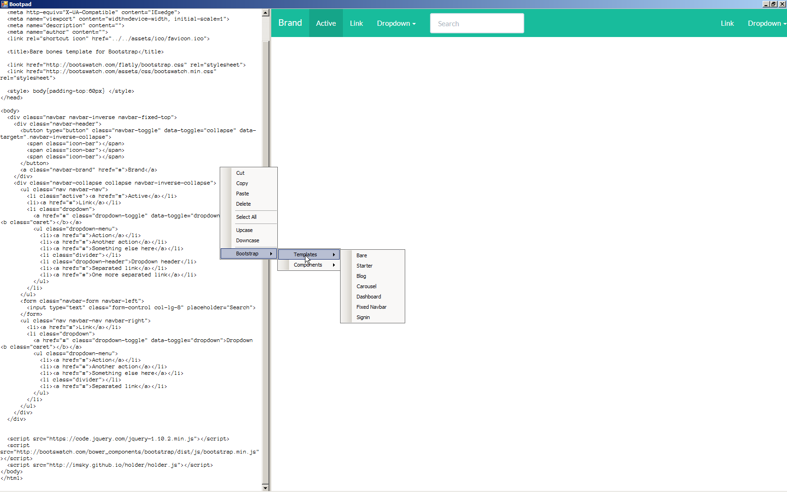

Bootpad
=======

A simple text editor with a built-in browser to rapidly build Bootstrap pages

TODO
====

* Replace Textbox control with a real editor control (ICSharp)
* Add saving and loading pages
* Provide a tabbed interface to switch between files
* Allow testing on different versions of browsers (currently only embeds IE)

